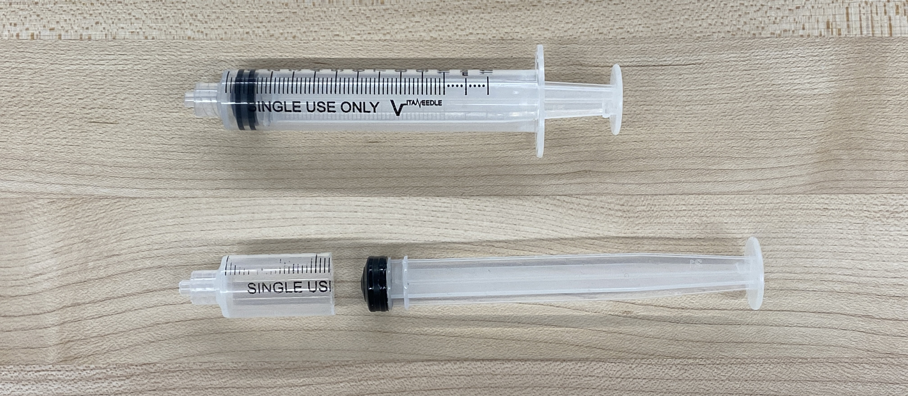
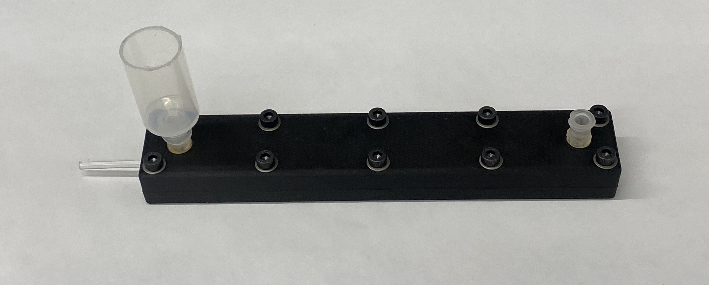
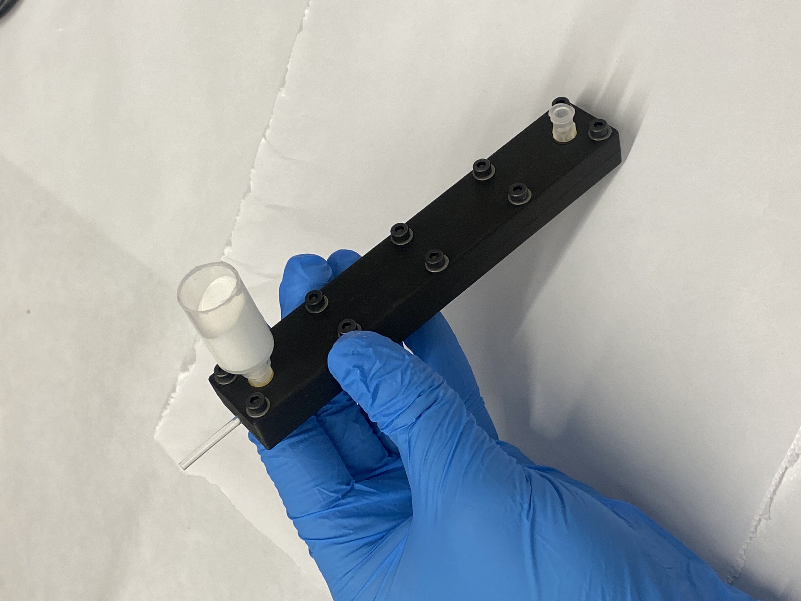
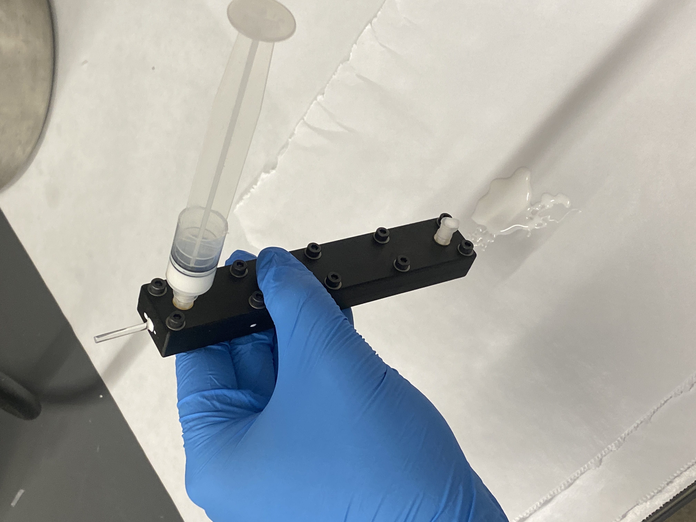
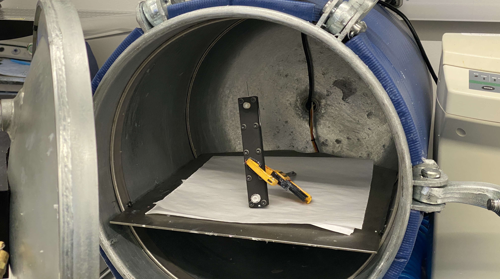
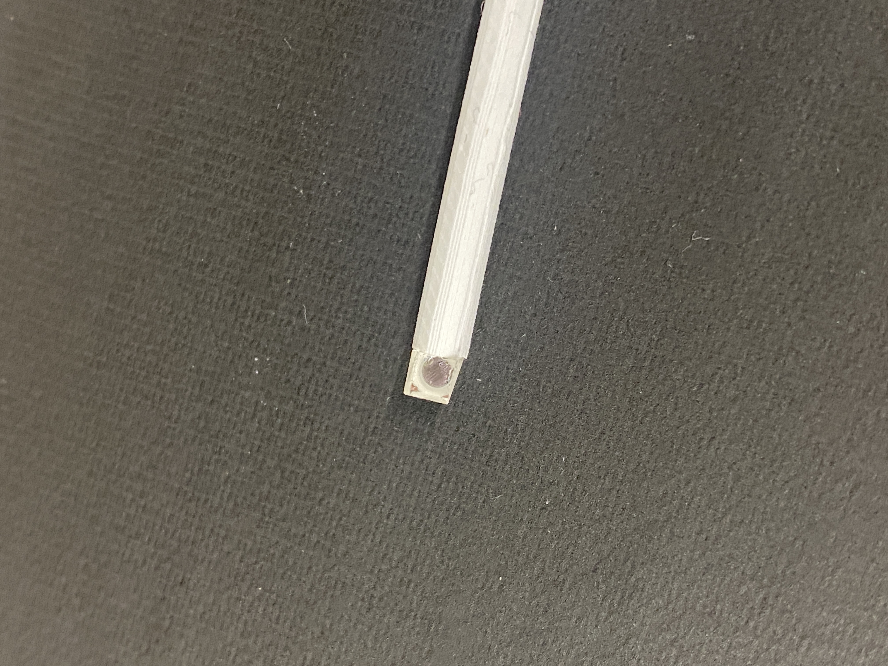

---
layout: default
title: Cladding
parent: Finger
grand_parent: Build Instructions
nav_order: 3
--- 

# Spectral Fiber Cladding and Prism

Printed parts:
- Prism alignment jig
- Fiber-cutting jig
- Cladding mold top
- Cladding mold bottom

COTS parts:
- M3 heat-set inserts
- M3 bolts
- 10-32 heat-set inserts (x2)
- 2.5mm acryilc PMMA fiber
- Luer lock connector (x2)
- Luer lock connector cover (x1)
- 3mm coated prism (x1) 

Materials/Tools Needed:
- 3M DP100 Plus Clear Epoxy
- epoxy dispensing gun
- dispensing mixing tips
- DragonSkin 10 NV
- Silicone thinner
- Titanium dioxide powder
- Luer lock syringe
- Hand saw/bandsaw

Equipment Needed:
- Thinky mixer or similar centrifuge
- vacuum chamber (optional)

## Cladding Casting

### Preliminary Steps:

Insert M3 heat-set inserts into all holes in the cladding mold bottom. Insert two 10-32 heat-set inserts into the holes in the cladding mold top, and then screw in luer lock connectors into both holes. Trim the syringe body using a saw until only ~2cm remains, and then screw it into one of the luer locks on the cladding. Cut a [140mm] length of 2.5mm PMMA fiber and set aside.

<html lang="en-US">
  

    <figure>
      
      <figcaption></figcaption>
    </figure>
  

  

    <figure>
      
      <figcaption></figcaption>
    </figure>
  

</html>

### Step 1:

Prepare the cladding mold by placing the fiber in the mold bottom and putting the mold top on. Screw in two screws at the bottom end [describe which end is which] so that the fiber is clamped in place. Now pull on the other end of the fiber until you feel that it is stretched taught, and screw in the bolts at that end. This ensures that the fiber is as straight as possible during while casting. Tighten all other bolts and set aside.

### Step 2:

Combine 10 grams of DragonSkin 10 NV Part A with [0.5?] grams of silicone thinner. Mix slightly with popsicle stick. Now pour in 10 grams of Part B along with [1?] gram of titanium dioloxide powder. Before putting the powder in it is helpful to break up small clumps with a popsicle stick. Mix until roughly combined then put in centrifuge until the silicone is a uniform opaque white (1-1.5 minutes)

### Step 3:

While holding the cladding mold at an angle, slowly pour the silicone mixture into the cut syringe, until the syringe body is filled around 3/4 of the way. Make sure you leave room for the syringe plunger to fit without trapping too much air. While holding the mold upright at a slight angle, *gently* press on the syringe plunger until silicone mixture comes out of the bottom luer lock. We have had luck with ensuring a lot of silicone mixture exits the bottom before putting on the luer lock cover. Once done, remove the syringe body from the top and *leave it uncovered* and prop the cladding mold at an angle. This will allow any trapped bubbles to leave through an air outlet. Allow to cure following the same instructions as the bladder casting. 

  <figure>
    
    <figcaption></figcaption>
  </figure>
  <figure>
    
    <figcaption></figcaption>
  </figure>

<html lang="en-US">
  

    <figure>
      
      <figcaption></figcaption>
    </figure>
  

</html>

### Step 4:

Once curing is complete, unscrew the mold and carefully separate the halves. The cladding will likely delaminate more easily from the mold bottom and stay attached to the top. Unscrew the luer lock connections and remove. Carefully peel the cladded fiber starting at one end. It may be helpful to cut the connected silicone stems with a razor blade to prevent the cladding from tearing. 

### Step 5:

Once free, carefully remove all of the flashing along the molding seam of the fiber. This flashing should be very thin and should separate by gently pulling and shearing with a fingernail. Place the cladded fiber into the fiber-cutting jig and make two perpendicular cuts with a razor blade. There are two lengths of fibers needed per SCANS finger, so ensure you keep track of which cut you make each time. 

## Prism Glue-up

### Step 1:

Prepare the epoxy applicator by fitting the applicator gun with the DP100 epoxy, the clear green mixing nozzle, and a luer lock syringe

### Step 2:

Remove a 3mm coated prism from the packaging and slot it into the 3D-printed prism glue-up mold

### Step 3: 

Holding a cladded fiber in one hand and the applicator gun in the other, deposit a small amount of epoxy on the cladded fiber. The blob of epoxy should almost cover the diameter of the 2.5mm PMMA fiber but not fully. If too much epoxy is present, then when the fiber is joined to the prism, excess epoxy can leak out and stick both components to the 3D-printed jig.

### Step 4:

Keeping the prism in the mold, slowly guide the spectral fiber in until the cut end with the epoxy is fully seated against the prism. You can clearly see how well the spectral fiber is seated by looking in through the top of the prism. Hold the spectral fiber and prism in place for a few minutes while the epoxy initially sets, and then prop up the free end of the spectral fiber with a folded paper towel so that everything sits flat. Allow the fiber and prism to cure for one hour.

### Step 5:

Carefully remove the fiber and prism from the mold.

<html lang="en-US">
  

    <figure>
      
      <figcaption></figcaption>
    </figure>
  

</html>