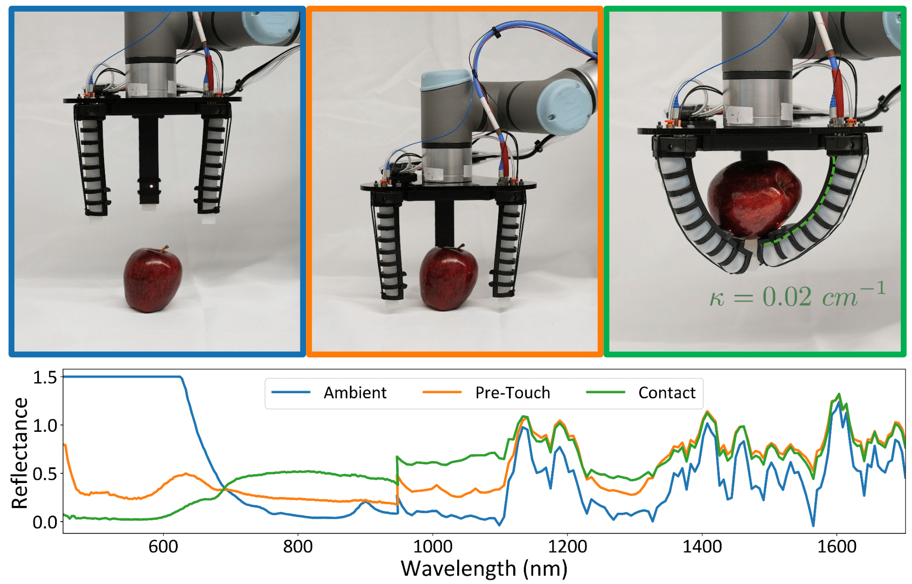

<html lang="en-US">
<head>
  <meta charset="UTF-8">
  <meta name="viewpoint" content="width=device-width, initial-scale=1.0">
  <!--<link rel="stylesheet" href="style.css"> -->
  <title>SCANS: A Soft Gripper with Curvature and Spectroscopy Sensors for In-Hand Material Differentiation</title>
</head>
<body>
  <div class="header-adder">
    <div class="title_set">
      <h1>SCANS: A Soft Gripper with Curvature and Spectroscopy Sensors for In-Hand Material Differentiation</h1>
    </div>
    <div class="names">
      <p><strong><a href="https://nhanson.io/">Nathaniel Hanson<sup>1,2*</sup></a>, Austin Allison<sup>1*</sup>, Charles DiMarzio<sup>1</sup>, <a  href="https://www.tpadir.info/">Taşkın Padır<sup>1,3</sup></a>, <a  href="https://www.kristendorsey.com/">Kristen L. Dorsey<sup>1</sup></a></strong></p>

      <sup>1</sup>Northeastern University, <sup>2</sup>MIT Lincoln Laboratory, <sup>3</sup>Amazon Robotics
  </div>

  <!-- <div>
    <div style="position:relative;padding-top:56.25%;">
      <iframe src="https://www.youtube.com/embed/36idGZOnESs?si=cUsFvBwUTLQvg5QG"  title="YouTube video player" frameborder="0" allow="accelerometer; autoplay; clipboard-write; encrypted-media; gyroscope; picture-in-picture" allowfullscreen style="position:absolute;top:0;left:0;width:100%;height:100%;"></iframe>
    </div>
  </div> -->

  </div>
  <h2>Abstract</h2>
  <p>We introduce the soft curvature and spectroscopy (SCANS) system: a versatile, electronics-free, fluidically actuated soft manipulator capable of assessing the spectral properties of objects either in hand or through pre-touch caging. This platform offers a wider spectral sensing capability than previous soft robotic counterparts. We perform a material analysis to explore optimal soft substrates for spectral sensing, and evaluate both pre-touch and in-hand performance. Experiments demonstrate explainable, statistical separation across diverse object classes and sizes (metal, wood, plastic, organic, paper, foam), with large spectral angle differences between items. Through linear discriminant analysis, we show that sensitivity in the near-infrared wavelengths is critical to distinguishing visually similar objects. These capabilities advance the potential of optics as a multi-functional sensory modality for soft robots.
  </p>

∗These authors contributed equally

<div style="text-align: center;">
  <figure>
      
    <figcaption>HASHI holding a piece of salmon nigiri
    </figcaption>
  </figure>
</div>

  <p>
    <a href="https://github.com/PARSES-Lab/scans">Link to the Github</a>
  </p>
</body>
</html>

### [ArXiv Link Coming Soon](7)
### Bibtex
  ```
@misc{hanson2025scans,
      title={HASHI: Highly Adaptable Seafood Handling Instrument for Manipulation in Industrial Settings}, 
      author={Nathaniel Hanson and Austin Allison and Charles DiMarzio and Taşkın Padır and Kristen L. Dorsey},
      year={2025},
      eprint={2510.6852379 },
      archivePrefix={arXiv},
      primaryClass={cs.RO}
}
```

Correspondence: nhanson2 [@] mit [.] edu